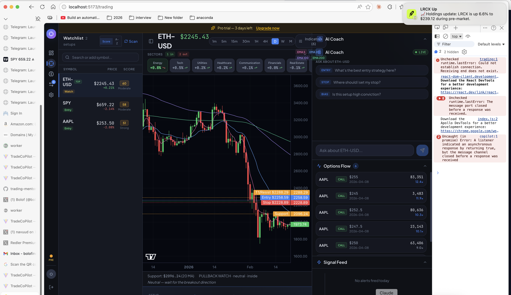

 # Implementation Plan: AI-Powered Multi-Timeframe Chart Analysis

**Spec**: [spec.md](spec.md)
**Branch**: 21-ai-chart-analysis
**Created**: 2026-04-07

## Technical Context

| Item | Value |
|------|-------|
| Language | Python 3.9+ (backend), TypeScript (frontend) |
| Framework | FastAPI (API), React + Tailwind (frontend) |
| Database | SQLite (local) / Postgres (production) |
| Notifications | Telegram Bot API (per-user DMs) |
| Market Data | yfinance (all timeframes: 1m through Monthly) |
| AI | Anthropic API (Haiku for standard, Sonnet for deep analysis) |
| Deployment | Railway (auto-deploy on push to main) |

### Dependencies
- No new dependencies needed
- Uses existing Anthropic API, yfinance, and streaming infrastructure
- Extends existing `ask_coach()`, `assemble_context()`, and MTF functions

### Integration Points
- `analytics/trade_coach.py` — Reuse `ask_coach()` for streaming, add analysis-specific prompt
- `analytics/intel_hub.py` — Fix `build_mtf_context()`, add `get_mtf_analysis()` wrapper
- `api/app/routers/intel.py` — New `/analyze-chart` endpoint, fix `/mtf/{symbol}`
- `alerting/notifier.py` — Append "AI Take" to alert messages (async, post-delivery)
- `api/app/dependencies.py` — Reuse `check_usage_limit()` with "ai_queries" feature

## Constitution Check

| Principle | Status | Notes |
|-----------|--------|-------|
| Protect Business Logic | PASS | No changes to alert rules, signal engine, or monitor. AI analysis is a new read-only layer that consumes existing data. |
| Test-Driven Development | PASS | Tests for: analysis prompt, MTF assembly, structured output parsing, usage limits, auto-analysis toggle |
| Local First | PASS | All endpoints testable locally with SQLite. yfinance works locally. Anthropic API key needed for AI tests. |
| Database Compatibility | PASS | New `chart_analyses` table uses standard pattern. `INTEGER PRIMARY KEY AUTOINCREMENT` → auto-converted to `SERIAL`. `?` params → wrapper translates to `%s`. |
| Alert Quality | PASS | Alert delivery unchanged. Auto-analysis runs asynchronously AFTER alert is sent. If AI fails, alert is unaffected. |
| Single Notification Channel | CAUTION | Auto-analysis sends a follow-up Telegram DM to the specific user (not group). This is per-user, not group channel. Follows `notify_user()` pattern, not `notify()`. Constitution says group-only for alerts, but AI analysis is supplementary, not an alert. |

## Solution Architecture

```
┌──────────────────────────────────────────────────────────┐
│              User clicks "Analyze Chart"                  │
│         (symbol: SPY, timeframe: 1H, bars: [...])        │
└────────────────────────┬─────────────────────────────────┘
                         │
                    ┌────▼─────┐
                    │ POST     │
                    │/analyze- │
                    │ chart    │
                    └────┬─────┘
                         │
         ┌───────────────┼───────────────┐
         │               │               │
    ┌────▼────┐    ┌─────▼─────┐   ┌─────▼─────┐
    │ Fetch   │    │ Fetch 2   │   │ Fetch     │
    │ User TF │    │ Higher TFs│   │ Win Rates │
    │ Bars    │    │ (auto)    │   │ & Context │
    └────┬────┘    └─────┬─────┘   └─────┬─────┘
         │               │               │
         └───────────────┼───────────────┘
                         │
                    ┌────▼─────┐
                    │ Build    │
                    │ Analysis │
                    │ Prompt   │
                    └────┬─────┘
                         │
                    ┌────▼─────┐
                    │ Claude   │
                    │ Streaming│
                    │ (Haiku)  │
                    └────┬─────┘
                         │
         ┌───────────────┼───────────────┐
         │               │               │
    ┌────▼────┐    ┌─────▼─────┐   ┌─────▼─────┐
    │ Stream  │    │ Parse     │   │ Save to   │
    │ to User │    │ Structured│   │ DB (opt)  │
    │ (SSE)   │    │ Plan      │   │           │
    └─────────┘    └───────────┘   └───────────┘
```

### Data Flow

1. **User triggers analysis** → frontend sends symbol, timeframe, optional bars
2. **Data assembly** (server-side):
   - Fetch bars for user's timeframe (if not provided by frontend)
   - Fetch 2 higher timeframes automatically
   - Compute indicators: MAs, RSI, VWAP (where applicable)
   - Run `analyze_daily_setup()` / `analyze_weekly_setup()` for structured context
   - Fetch win rates for this symbol's alert types
   - Fetch S/R levels, SPY context
3. **Prompt construction** → purpose-built analysis prompt with:
   - OHLCV bars for user's timeframe (last 50-100)
   - Higher TF summaries (structured, not raw bars)
   - Indicators and levels
   - Historical win rate data
   - Explicit output format instructions
4. **Claude streams response** → parsed into structured trade plan + reasoning
5. **Results** → streamed to frontend, optionally saved to `chart_analyses` table

### Files to Modify

| File | Change | Risk |
|------|--------|------|
| `analytics/intel_hub.py` | Fix `build_mtf_context()` signature, add `get_mtf_analysis()` wrapper | Low |
| `api/app/routers/intel.py` | Add `/analyze-chart` endpoint, fix `/mtf/{symbol}`, add `/analysis-history` | Med |
| `api/app/schemas/intel.py` | Add `AnalyzeChartRequest`, `AnalysisResponse` schemas | Low |
| `api/app/models/user.py` | Add `auto_analysis_enabled` column | Low |
| `alerting/notifier.py` | Add async AI analysis after alert delivery | Low |
| `db.py` | Add `chart_analyses` table to `init_db()` | Low |
| `api/app/main.py` | Add migration for `auto_analysis_enabled` column | Low |

### Files to Add

| File | Purpose |
|------|---------|
| `analytics/chart_analyzer.py` | Core analysis logic: data assembly, prompt construction, structured output parsing |
| `api/app/models/chart_analysis.py` | SQLAlchemy ORM model for `chart_analyses` table |
| `tests/test_chart_analyzer.py` | Unit tests for analysis prompt, MTF assembly, output parsing |
| `tests/test_analyze_chart_api.py` | Integration tests for the API endpoint |

## Implementation Approach

### Phase 1: Data Layer + MTF Fix
1. **Fix `build_mtf_context()` in `analytics/intel_hub.py`**:
   - Add `get_mtf_analysis(symbol: str) -> dict` wrapper that calls `get_daily_bars()`, `get_weekly_bars()`, `analyze_daily_setup()`, `analyze_weekly_setup()` internally
   - Returns structured dict with `daily`, `weekly`, `alignment`, `confluence_score`
   - Fix the `/intel/mtf/{symbol}` endpoint to call this wrapper
2. **Add `chart_analyses` table to `db.py` `init_db()`** following existing pattern
3. **Create `api/app/models/chart_analysis.py`** SQLAlchemy ORM model
4. **Add `auto_analysis_enabled` column to User model** + migration in `main.py`
5. **Add schemas** to `api/app/schemas/intel.py`: `AnalyzeChartRequest`, `ChartAnalysisResponse`

### Phase 2: Core Analysis Engine
1. **Create `analytics/chart_analyzer.py`** with:
   - `assemble_analysis_context(symbol, timeframe, bars=None) -> dict`:
     - Fetches bars for user's TF if not provided
     - Auto-detects and fetches 2 higher TFs
     - Computes indicators (MAs, RSI) for each TF
     - Calls `get_mtf_analysis()` for daily/weekly structured context
     - Fetches win rates from `get_alert_win_rates()`
     - Fetches SPY context, S/R levels
   - `build_analysis_prompt(context: dict) -> str`:
     - Purpose-built system prompt for structured trade plan output
     - Includes explicit format instructions (direction, entry, stop, targets, R:R, confidence, confluence, reasoning)
     - Adapts language to timeframe (scalp vs day vs swing vs position)
     - Includes "No Trade" as a valid output
   - `compute_confluence_score(user_tf_data, higher_tf_data) -> int`:
     - Scores 0-10 based on trend alignment (0-4), level proximity (0-3), momentum alignment (0-3)
   - `parse_trade_plan(ai_response: str) -> dict`:
     - Extracts structured fields from AI response text
     - Returns dict with all trade plan fields
2. **Write tests first** (`tests/test_chart_analyzer.py`):
   - Test `assemble_analysis_context()` with mock yfinance data
   - Test `build_analysis_prompt()` includes all required sections
   - Test `compute_confluence_score()` returns correct scores for known inputs
   - Test `parse_trade_plan()` extracts fields from sample AI responses
   - Test timeframe-appropriate stops/targets (1m analysis never suggests weekly hold)

### Phase 3: API Endpoint
1. **Add `POST /intel/analyze-chart`** to `api/app/routers/intel.py`:
   - Validate request (symbol, timeframe)
   - Check usage limit (`check_usage_limit(user, "ai_queries", db)`)
   - Check cache (5-min TTL on symbol+timeframe+user)
   - Call `assemble_analysis_context()` + `build_analysis_prompt()`
   - Stream response via SSE using `ask_coach()`
   - Parse structured plan from completed stream
   - Return plan event + reasoning event + done event
2. **Add `GET /intel/analysis-history`**:
   - Query `chart_analyses` table filtered by user_id, optional symbol, date range
   - Return list of past analyses with outcomes
3. **Add `PUT /intel/analysis/{id}/outcome`**:
   - Update `actual_outcome` and `outcome_pnl` on saved analysis
4. **Add `PUT /settings/auto-analysis`**:
   - Toggle `auto_analysis_enabled` on User model
5. **Write integration tests** (`tests/test_analyze_chart_api.py`):
   - Test endpoint returns structured SSE events
   - Test usage limit enforcement
   - Test cache hit on duplicate request
   - Test analysis-history retrieval
   - Test outcome recording

### Phase 4: Alert Auto-Analysis
1. **Modify `alerting/notifier.py`**:
   - After `_send_telegram_to()` succeeds for an alert, if user has `auto_analysis_enabled`:
     - Spawn a background task to generate AI analysis
     - On completion, send a follow-up Telegram message with "AI Take" section
     - Format: "AI Take: Long $142.50, Stop $141.80, T1 $144.20 (2.4:1). Confluence 7/10."
   - If AI analysis fails, silently log — do not retry or notify
2. **Write tests**:
   - Test auto-analysis fires after alert delivery
   - Test auto-analysis does not delay alert delivery
   - Test auto-analysis failure is silent

### Phase 5: Frontend — Dedicated AI CoPilot Page
1. **Create new "AI CoPilot" page** as a top-level nav tab (alongside Trading, Analysis, Settings):
   - **Top bar**: Symbol picker (populated from user's watchlist) + Timeframe dropdown (1m through Weekly) + "Analyze" button
   - **Left panel**: Mini candlestick chart showing the bars being analyzed (read-only, Plotly)
   - **Right panel**: Structured Trade Plan card with: Direction badge (LONG/SHORT/NO TRADE), Entry/Stop/T1/T2 prices, R:R ratio, Confidence label, Confluence score (0-10), Timeframe fit
   - **Below chart**: AI reasoning section (streaming text) + Higher TF summary
   - **Bottom section**: Analysis history feed — recent analyses with outcome tracking, "Record Outcome" button
2. **Add auto-analysis toggle to Settings page**
3. **Add confluence score badge to alert cards in Signal Feed**

## Test Plan

### Unit Tests
- [ ] `test_chart_analyzer.py::test_assemble_context_fetches_higher_tfs` — verifies 2 higher TFs are fetched
- [ ] `test_chart_analyzer.py::test_timeframe_hierarchy` — verifies correct TF mapping (5m→1H→D, 1H→D→W, etc.)
- [ ] `test_chart_analyzer.py::test_confluence_score_all_aligned` — all TFs bullish = score 8-10
- [ ] `test_chart_analyzer.py::test_confluence_score_conflicting` — opposing TFs = score 0-3
- [ ] `test_chart_analyzer.py::test_prompt_includes_all_sections` — prompt has bars, indicators, levels, win rates
- [ ] `test_chart_analyzer.py::test_prompt_adapts_to_timeframe` — scalp vs swing language differs
- [ ] `test_chart_analyzer.py::test_parse_trade_plan_complete` — all fields extracted from well-formatted response
- [ ] `test_chart_analyzer.py::test_parse_trade_plan_no_trade` — "No Trade" response parsed correctly
- [ ] `test_intel_hub.py::test_get_mtf_analysis_returns_dict` — wrapper returns structured dict
- [ ] `test_intel_hub.py::test_get_mtf_analysis_handles_missing_data` — graceful fallback on yfinance failure

### Integration Tests
- [ ] `test_analyze_chart_api.py::test_endpoint_streams_sse` — returns SSE events (plan, reasoning, done)
- [ ] `test_analyze_chart_api.py::test_usage_limit_enforced` — 429 after limit exceeded
- [ ] `test_analyze_chart_api.py::test_cache_hit` — second call within 5min returns cached result
- [ ] `test_analyze_chart_api.py::test_analysis_history` — saved analyses retrievable
- [ ] `test_analyze_chart_api.py::test_outcome_recording` — outcome update works

### E2E Validation
1. **Setup**: Login as Pro user, navigate to chart page for SPY
2. **Action**: Switch to 1H timeframe, click "Analyze Chart"
3. **Verify**:
   - Structured trade plan appears with all fields (direction, entry, stop, targets, R:R, confidence)
   - Confluence score shown with higher TF summary
   - Historical win rate referenced (if available)
   - Analysis appears in journal/history
4. **Test No Trade**: Analyze a choppy, directionless symbol — verify "No Trade" response with key levels
5. **Test Auto-Analysis**: Enable auto-analysis, trigger an alert, verify follow-up Telegram message
6. **Test Usage Limits**: Exhaust daily limit, verify 429 response
7. **Cleanup**: Disable auto-analysis, clear test analyses

## Out of Scope

- Chart screenshot / vision-based analysis (numerical approach is more accurate and cheaper)
- Autonomous trade execution (AI suggests, human decides)
- Backtesting AI recommendations against historical data
- Custom indicator support in AI analysis
- Real-time streaming analysis (continuous updates as price moves)
- Options-specific analysis

## Research Notes

See [research.md](research.md) for detailed decision rationale on:
- Numerical vs vision analysis (numerical chosen)
- Structured output approach (prompt-based, not tool-use)
- Multi-timeframe data assembly strategy
- Model selection (Haiku standard, Sonnet deep)
- Caching strategy (5-min TTL)
- Alert auto-analysis architecture (async, post-delivery)
- MTF endpoint bug fix approach
